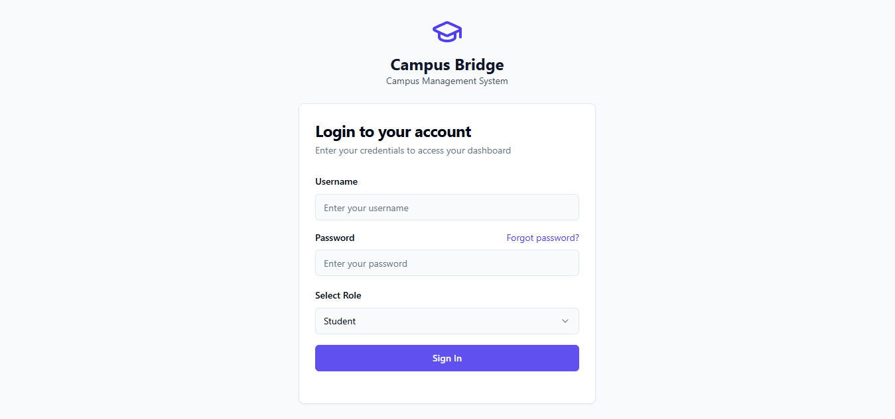
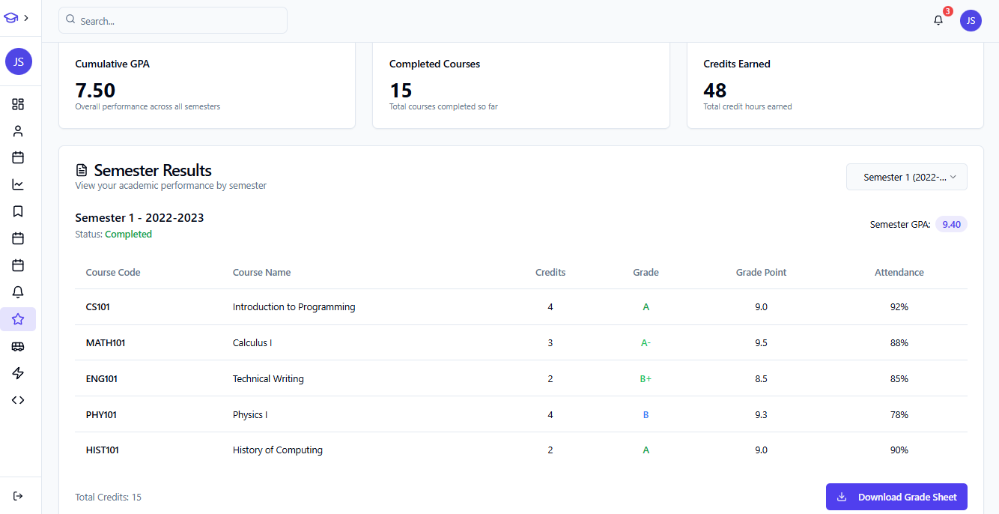
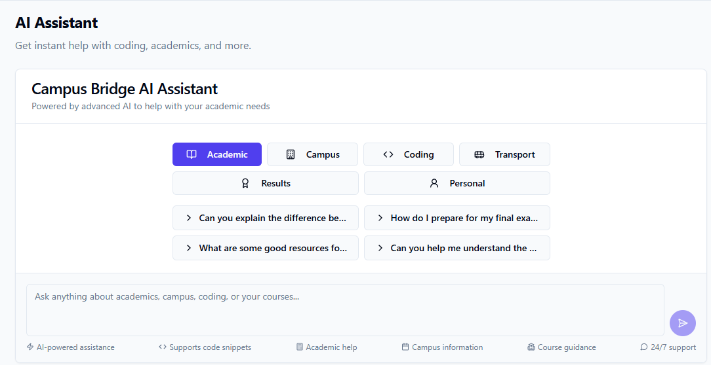
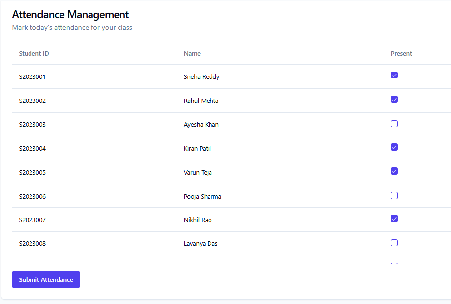
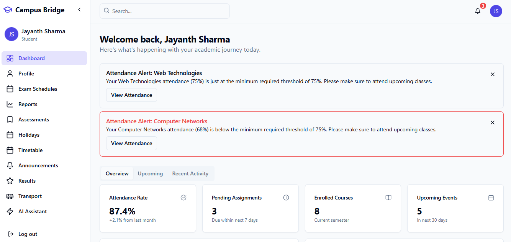
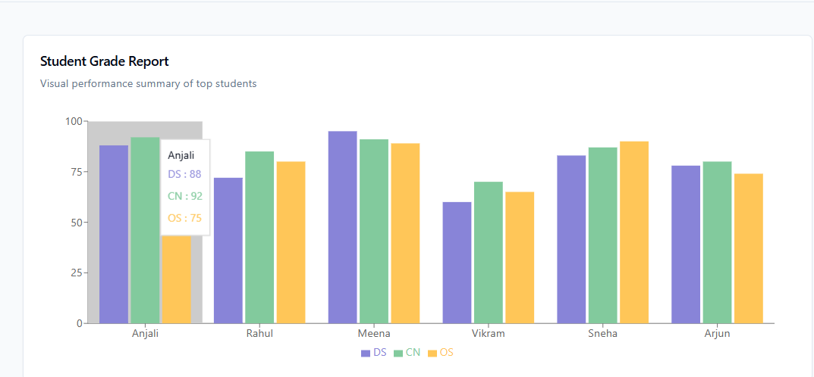

Project Title: CAMPUS BRIDGE

Selected Domain: WEB DEVELOPMENT

Problem Statement: “Campus Bridge – Integrated Academic LMS + Coding Skill Development Platform”

Project Description:
CampusBridge: College Portal System
CampusBridge is a comprehensive, AI-integrated web portal designed to streamline academic and administrative processes in a college environment. It features role-based dashboards for students, faculty, and admins, each tailored with powerful tools and interactive modules to manage daily academic workflows.

🎯 Core Objectives
Enhance communication between students, faculty, and admin.

Automate and digitize academic functions (attendance, assignments, courses).

Visualize academic performance using modern data visualization.

Empower decision-making through smart admin tools and analytics.

🔑 Features by Role
👨‍🎓 Student Dashboard
📚 View assigned courses (PDFs & video links)

✅ Track attendance

📥 Submit/view assignments

🧠 Ask questions via the integrated AI Assistant

🧾 View announcements and grade reports

👩‍🏫 Faculty Dashboard
📤 Upload/give course content (PDFs/videos)

📊 Mark and manage student attendance

✍️ Post assignments based on subjects

👁 Review assignment submissions

🎤 Post announcements

🧑‍💼 Admin Dashboard
🛠 Manage user roles (student/faculty/admin)

🧾 Post and edit announcements

📊 View interactive grade reports with graphs

📅 Manage class timetables for multiple classes

✨ Monitor and control system-wide functionalities

🖼 Screenshots of our project

🛠 Tech Stack
Frontend: React + TypeScript, TailwindCSS, Shadcn/UI

Backend: Flask (API integration)

Database: PostgreSQL (for user roles, announcements, attendance)

Auth: Context API-based Auth Layer (role-based routing)

Charts: Recharts (grade reports)

🚀 Future Enhancements
🧠 Smarter AI responses based on user queries

📈 Admin analytics dashboard

🔔 Push notifications for new assignments and announcements

📂 File storage and resume upload

